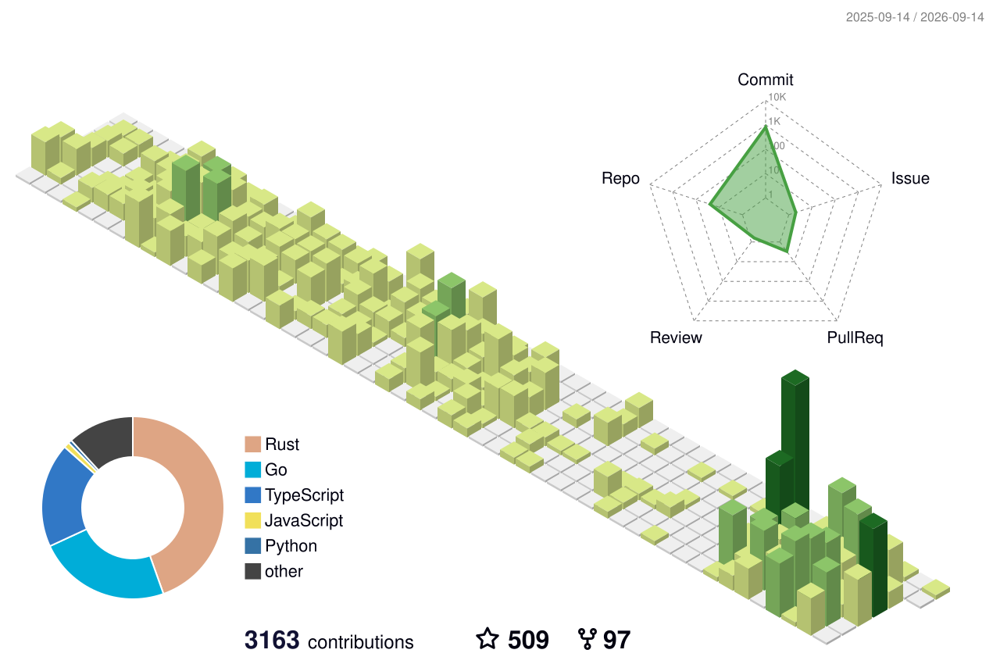

  

    

  
  
  
  
  
  
  
   
  
  
  
  
  
  
  

### Featured

| 项目 | 简介 | |
| :-- | :-- | :-- |
| [**gemini-web2api-go**](https://github.com/zexadev/gemini-web2api-go) | 把 Gemini 网页协议反代成 OpenAI 兼容 API — 单二进制 · Chrome 指纹 · 内置管理台 |  |
| [**lapisnote**](https://github.com/zexadev/lapisnote) | Local-first 桌面笔记应用，内置 AI 写作助手 |  |
| [**tianjie5**](https://github.com/zexadev/tianjie5) | 天际5 — 浏览器里的开放世界 RPG（Three.js · 零构建） |  |
| [**hudo**](https://github.com/zexadev/hudo) | 开发环境一键引导 CLI |  |
| [**plantvillage-on-yolo11**](https://github.com/zexadev/plantvillage-on-yolo11) | 基于 YOLOv11 的作物病害识别 |  |

### Activity

<!-- STATS:START -->
过去一年 <b>253</b> commits · 累计 <b>176</b> pull requests · <b>52</b> stars · <b>28</b> 个公开仓库
<!-- STATS:END -->

<picture>
  <source media="(prefers-color-scheme: dark)" srcset="profile-3d-contrib/profile-night-view.svg" />
  
</picture>

  <picture>
    <source media="(prefers-color-scheme: dark)" srcset="https://raw.githubusercontent.com/zexadev/zexadev/output/github-snake-dark.svg" />
    <source media="(prefers-color-scheme: light)" srcset="https://raw.githubusercontent.com/zexadev/zexadev/output/github-snake.svg" />
    
  </picture>

